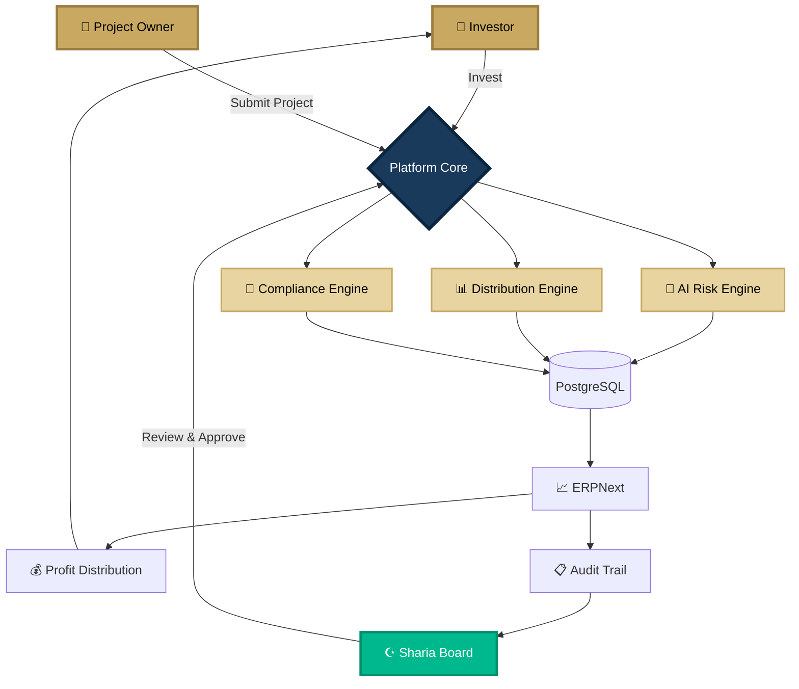
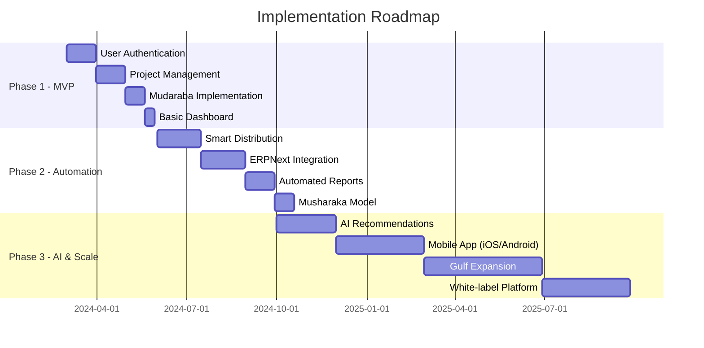
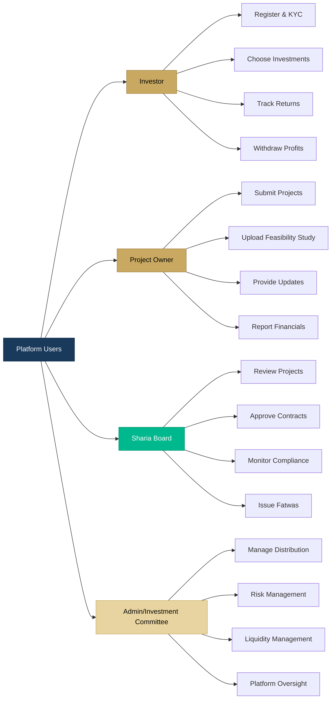
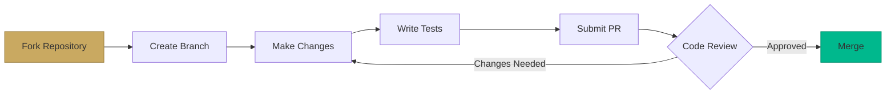

<div align="center">

<!-- Animated Islamic Geometric Pattern Header -->


#  Islamic Investment Orchestrator 

### منصة الاستثمار الإسلامي الذكية

<p align="center">
  
</p>

---

### ✨ *"Where Islamic Finance Meets Modern Technology"* ✨

[](LICENSE)
[](SHARIA.md)
[](ROADMAP.md)
[](README_AR.md)

</div>

---

## 🕌 Sacred Vision

> **"A digital sanctuary where wealth grows through faith, not interest."**

This platform represents the convergence of **1,400 years of Islamic financial wisdom** with **21st-century technology**. We are building more than an investment platform—we are crafting a **complete Islamic financial infrastructure** that honors Sharia principles while leveraging cutting-edge AI, blockchain concepts, and cloud architecture.

<div align="center">

### 🎯 Core Mission

| Principle | Implementation |
|:---------:|:--------------|
| **حلال** | 100% Sharia-compliant through dedicated board oversight |
| **عدل** | Fair profit distribution via Mudaraba & Musharaka |
| **شفافية** | Complete transparency with real-time reporting |
| **أمانة** | Trustworthy governance with full audit trails |
| **تكافل** | Community-driven risk sharing mechanisms |

</div>

---

## 🌟 The Problem We Solve

<table>
<tr>
<td width="50%">

### 😰 For Investors

```diff
- Riba-based banking (interest)
- Lack of halal alternatives
- Complex Islamic contracts
- High investment barriers
- No risk diversification
- Zero transparency
```

</td>
<td width="50%">

### 😓 For Project Owners

```diff
- Difficult to reach investors
- No professional presentation tools
- Sharia compliance complexity
- Lack of governance systems
- No accounting infrastructure
- Limited credibility
```

</td>
</tr>
</table>

<div align="center">

### ✅ Our Solution


</div>

---

## 🏗️ Architectural Excellence

<div align="center">



</div>

### 🎨 Technology Stack

<div align="center">

#### Backend Infrastructure


#### Frontend Excellence


#### ERP & Business Logic


#### AI & Automation


#### Security & Compliance


</div>

---

## 💎 Core Features

<table>
<tr>
<td width="33%">

### ☪️ Sharia Compliance
- **Rule Engine** for automatic validation
- **Approval Workflow** with Sharia board
- **Contract Templates** (Mudaraba, Musharaka)
- **Real-time Monitoring** of compliance
- **Audit Trail** for every transaction

</td>
<td width="33%">

### 🤖 AI-Powered Intelligence
- **Risk Scoring** for projects
- **Fraud Detection** algorithms
- **Investor Profiling** & matching
- **Smart Recommendations**
- **Predictive Analytics**

</td>
<td width="33%">

### 📊 Advanced Analytics
- **Real-time Dashboards**
- **Performance Metrics**
- **Profit Distribution** tracking
- **Portfolio Analysis**
- **Custom Reports**

</td>
</tr>
</table>

---

## 🚀 Development Roadmap

<div align="center">



</div>

### 📅 Milestones

| Phase | Duration | Key Deliverables | Status |
|:-----:|:--------:|:-----------------|:------:|
| **Phase 1 - MVP** | 3 months | Core platform, Mudaraba model, Basic reporting | 🟡 In Progress |
| **Phase 2 - Automation** | 6 months | Smart distribution, ERP integration, Advanced reports | ⚪ Planned |
| **Phase 3 - AI & Scale** | Ongoing | AI engine, Mobile apps, Regional expansion | ⚪ Planned |

---

## 📐 Investment Models

<div align="center">

### 🤝 Mudaraba (المضاربة)

```yaml
Structure:
  Investor: Provides capital (رب المال)
  Manager: Manages business (المضارب)
  
Profit Distribution:
  - Pre-agreed percentage split
  - Example: 70% investor, 30% manager
  
Loss Handling:
  - Financial loss: Borne by investor
  - Effort loss: Borne by manager
  
Compliance:
  ✓ No guaranteed returns
  ✓ No interest-based compensation
  ✓ Profit-sharing only
```

### 🏢 Musharaka (المشاركة)

```yaml
Structure:
  All Parties: Contribute capital
  All Parties: Share in management
  
Profit Distribution:
  - Based on capital contribution
  - Or pre-agreed ratios
  
Loss Handling:
  - Shared proportionally
  - Based on capital contribution
  
Compliance:
  ✓ Joint liability
  ✓ Transparent governance
  ✓ Equal rights framework
```

</div>

---

## 🎯 Why This Platform Is Powerful

<div align="center">

| Factor | Impact |
|:-------|:-------|
| 🕌 **Faith + Finance** | Addresses both spiritual and material needs of 1.8B Muslims |
| 🌍 **Massive Underserved Market** | $3.8T Islamic finance industry growing at 10-12% annually |
| 💡 **Tech Innovation Gap** | Very few digital-first, Sharia-compliant investment platforms |
| 🚀 **Scalability** | Replicable across 50+ Muslim-majority countries |
| 🏆 **First-Mover Advantage** | Limited competition in Arabic digital Islamic finance |

</div>

---

## 🛡️ Security & Compliance

<table>
<tr>
<td width="50%">

### 🔐 Security Measures
- ✅ End-to-end encryption
- ✅ Two-factor authentication (2FA)
- ✅ Role-based access control (RBAC)
- ✅ Complete audit logging
- ✅ Regular security audits
- ✅ GDPR & data privacy compliance

</td>
<td width="50%">

### ☪️ Sharia Compliance
- ✅ Dedicated Sharia board oversight
- ✅ Automated compliance engine
- ✅ Contract template validation
- ✅ Real-time monitoring
- ✅ Quarterly Sharia audits
- ✅ Public compliance reports

</td>
</tr>
</table>

---

## 👥 User Roles & Permissions

<div align="center">



</div>

---

## 📊 Smart Risk Distribution Example

<div align="center">

### Traditional vs. Our Approach

| Approach | Investment Strategy | Risk Level |
|:---------|:-------------------|:-----------|
| **Traditional** | $10,000 → Single Project | 🔴 **High Risk** |
| **Our Platform** | $10,000 → Distributed Across: | 🟢 **Low Risk** |
| | ↳ $2,000 in Project A | |
| | ↳ $3,000 in Project B | |
| | ↳ $5,000 in Project C | |

### Benefits
✅ **Diversification** reduces exposure  
✅ **AI-driven allocation** based on risk profiles  
✅ **Automatic rebalancing** for optimal returns  
✅ **Professional fund management** approach  

</div>

---

## 💰 Revenue Model

<div align="center">

| Revenue Stream | Description | Rate |
|:--------------|:------------|:-----|
| **Performance Fee** | Percentage of profits generated | 5-10% |
| **Premium Subscriptions** | Advanced features for large investors | $99-$499/mo |
| **Project Listing Fee** | One-time fee for project owners | $500-$2,000 |
| **White-label Licensing** | Platform licensing to financial institutions | Custom |

</div>

---

## 🌍 Target Markets

<div align="center">

### Primary Markets (Phase 1-2)
🇸🇦 **Saudi Arabia** | 🇦🇪 **UAE** | 🇰🇼 **Kuwait** | 🇶🇦 **Qatar** | 🇧🇭 **Bahrain** | 🇴🇲 **Oman**

### Secondary Markets (Phase 3)
🇪🇬 **Egypt** | 🇯🇴 **Jordan** | 🇹🇷 **Turkey** | 🇲🇾 **Malaysia** | 🇮🇩 **Indonesia** | 🇵🇰 **Pakistan**

### Market Size
- **GCC Islamic Finance**: $1.2 Trillion
- **MENA Region**: $2.4 Trillion  
- **Global Islamic Finance**: $3.8 Trillion
- **Annual Growth Rate**: 10-12%

</div>

---

## 🎓 Getting Started

<details>
<summary><b>📦 Installation</b></summary>

```bash
# Clone the repository
git clone https://github.com/yourusername/islamic-investment-platform.git

# Navigate to project directory
cd islamic-investment-platform

# Install dependencies
npm install
pip install -r requirements.txt

# Set up environment variables
cp .env.example .env

# Initialize database
python manage.py migrate

# Start development server
npm run dev
```

</details>

<details>
<summary><b>🔧 Configuration</b></summary>

```yaml
# config/settings.yaml
database:
  host: localhost
  port: 5432
  name: islamic_investment_db
  
sharia:
  board_approval_required: true
  auto_validation: true
  
ai:
  risk_scoring_enabled: true
  fraud_detection_enabled: true
  
security:
  two_factor_auth: true
  session_timeout: 30 # minutes
```

</details>

<details>
<summary><b>🧪 Testing</b></summary>

```bash
# Run all tests
pytest

# Run specific test suite
pytest tests/test_sharia_compliance.py

# Run with coverage
pytest --cov=src --cov-report=html
```

</details>

---

## 📚 Documentation

<div align="center">

| Document | Description | Link |
|:---------|:------------|:-----|
| 📖 **API Documentation** | RESTful API reference | [View Docs](docs/API.md) |
| ☪️ **Sharia Guidelines** | Islamic finance principles | [View Docs](docs/SHARIA.md) |
| 🏗️ **Architecture Guide** | System design & patterns | [View Docs](docs/ARCHITECTURE.md) |
| 🔐 **Security Policy** | Security best practices | [View Docs](docs/SECURITY.md) |
| 🤝 **Contributing** | How to contribute | [View Docs](CONTRIBUTING.md) |

</div>

---

## 🤝 Contributing

We welcome contributions from the community! Please read our [Contributing Guidelines](CONTRIBUTING.md) before submitting pull requests.

### Development Workflow



---

## 📜 License

This project is proprietary software. All rights reserved.

**Copyright © 2024 Islamic Investment Orchestrator Platform**

---

## 👨‍💻 Development Team

<div align="center">

### 🎯 Core Team

| Role | Responsibility |
|:-----|:--------------|
| **Chief Technology Officer** | Architecture & Technical Strategy |
| **Full Stack Developer** | Platform Development |
| **ERPNext Specialist** | ERP Integration & Customization |
| **Sharia Advisor** | Islamic Compliance Oversight |
| **DevOps Engineer** | Infrastructure & Deployment |
| **UI/UX Designer** | User Experience Design |

</div>

---

## 📞 Contact & Support

<div align="center">

### Get In Touch

[](mailto:info@islamicinvest.com)
[](https://linkedin.com)
[](https://twitter.com)
[](https://discord.gg)

### Office Location
📍 **Riyadh, Kingdom of Saudi Arabia**  
📞 **+966 12 345 6789**

</div>

---

## 🌟 Acknowledgments

<div align="center">

### Special Thanks To

- The global Islamic finance community
- Open source contributors
- Our early adopters and beta testers
- Sharia scholars and advisors
- Technology partners and supporters

</div>

---

<div align="center">

### 🕌 Built with Faith, Powered by Technology 🕌


---

### ⭐ Star this repository if you believe in ethical Islamic finance! ⭐

[](https://github.com/yourusername/islamic-investment-platform)
[](https://github.com/yourusername/islamic-investment-platform/fork)
[](https://github.com/yourusername/islamic-investment-platform)

---

<p align="center">
  
</p>

**Made with ❤️ and ☪️ for the Islamic Finance Community**

</div>
